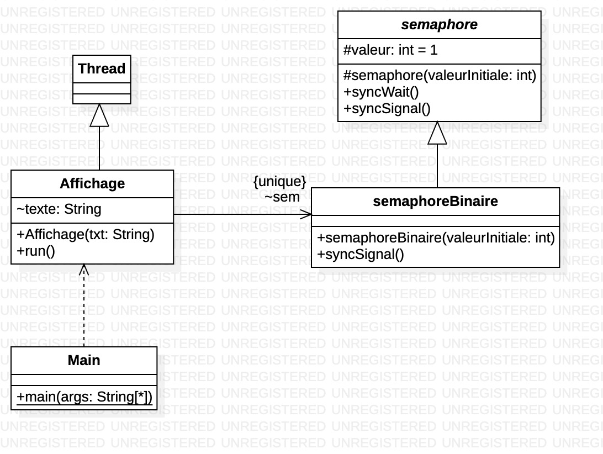

# Programmation parallèle sur machine à mémoire partagée

> Eliott Barker  
> INF3-FA  
> 2024-2025  

## Introduction

## Conception

### Mobile

  
**Figure 1** : Diagramme de classes  

### Affichage

  
**Figure 2** : Diagramme de classes  

## Affichage d'un mobile

```java
Container leConteneur = getContentPane();
sonMobile = new UnMobile(LARG, HAUT);
leConteneur.add(sonMobile);
setSize(LARG, HAUT);
setVisible(true);
```

Ce code permet d'afficher un mobile dans une fenêtre en précisant sa largeur et sa hauteur.  
Il faut bien le rendre visible pour qu'il s'affiche.  

## Start d'un thread

```java
Thread laTache= new Thread(sonMobile);
laTache.start();
```

Pour lancer un thread, il faut l'instancier avec un objet `Runnable` et appeler ensuite la méthode `start`.

## Modification du comportement du mobile

Pour modifier le comportement du mobile, il faut bien modifier la méthode `run` de la classe `UnMobile`.  
C'est cette méthode qui est appelée lorsqu'on lance le thread et qui donc exécute le processus du mobile.

## Analyse de la ressource critiques et section critique

Les threads ne doivent pas écrire en même temps sur le terminal. La ressource critique est donc `System.out`.  
Il y a une boucle et il ne faut pas que les threads se superposent. La section critique est donc la boucle.  

Pour définir une section critique en Java, on utilise le mot-clé `synchronized`.  

```java
static Exclusion exclusionMutuelle = new Exclusion();

// ...

synchronized (exclusionMutuelle) //section critique
{
    //code
}
```

Si on a trouvé la ressource critique on peut aussi faire comme ça :

```java
synchronized (System.out) //section critique
{
    //code
}
```

La méthode `synchronized` permet d'avoir qu'un seul thread qui peut accéder à la section critique à la fois.  

## Semaphores

Les semaphores fonctionnent avec 2 états : `wait` et `signal`.  
`wait` permet de bloquer un thread si la ressource critique est déjà utilisée.  
`signal` permet de débloquer un thread qui attend la ressource critique.  

```java
static semaphoreBinaire sem = new semaphoreBinaire(1);

// ...

sem.wait(); //section critique

// CODE

sem.signal(); //fin de la section critique
```

La première ressource qui passe par `sem.wait()` va pouvoir accéder à la section critique. Les autres attendent que la ressource soit libérée. Quand la ressource passe par `sem.signal()`, un thread qui attend la ressource va pouvoir accéder à la section critique.  

Il faut que `sem` soit en `static` puisqu'il doit être partagé entre les threads.

## semaphore - Classe

Dans la classe `semaphore`, l'incrément et le décrément indique le nombre de ressources disponibles.  
Par défaut il y a `x` ressources disponibles, quand une ressource utilise la section critique, le nombre de ressources disponibles est décrémenté. Quand cette ressource a fini d'utiliser la section critique, le nombre de ressources disponibles est incrémenté.  

Quand le nombre de ressources disponibles est à 0, les autres ressources qui veulent accéder à la section critique sont bloquées. Elles attendent dans une boucle que le nombre de ressources disponibles soit supérieur à 0.  

## semaphoreBinaire

Pour afficher les indications suivantes :

```text
j’entre en section critique
je sors de la section critique
```

Il faut ajouter un `System.out.println()` dans la méthode `wait()` et `signal()` de `semaphoreBinaire` (il faut donc refaire une méthode hérité de `wait()` de `semaphore` dans `semaphoreBinaire`).  
Pour le `System.out.println("j’entre en section critique");`, il faut le mettre après le `sem.wait();` et pour le `System.out.println("je sors de la section critique");`, il faut le mettre avant le `sem.signal();`.  
Pour le premier cas, il faut le mettre après parce qu'il boucle dans `sem.wait()` et donc si il passe cette instruction c'est qu'il est entré dans la section critique.  
Pour le deuxième cas, il faut le mettre avant parce que quand il donne le signal, il sort et une autre ressource peut rentrer directement dans la section critique. Notre message risque de s'afficher en même temps que le message de la ressource qui rentre dans la section critique.  

## Avoir plusieurs mobiles sur la même fenêtre

On peut utiliser un `GridLayout` pour indiquer le nombre de lignes et de colonnes qu'on veut sur notre fenêtre.

```java
Container leConteneur = getContentPane();
leConteneur.setLayout (new GridLayout(NBRLIG, NBRCOL));
```

## Intégration des semaphores dans le mobile

Pour intégrer les semaphores dans le mobile, il faut faire 6 boucles `for` pour définir les 6 sections de la fenêtre :

- 0 -> 1/3 : allé
- 1/3 -> 2/3 : section critique allé
- 2/3 -> 3/3 : fin de l'allé
- 3/3 -> 2/3 : retour
- 2/3 -> 1/3 : section critique retour
- 1/3 -> 0 : fin du retour

La boucle qui va de 1/3 à 2/3 est une section critique avec la boucle qui va de 2/3 à 1/3.  
La ressource critique est `JPanel`.  

Pour voir l'application du semaphore, on peut rendre aléatoire le temps des mobiles.

```java
Random random = new Random();
sonTemps = random.nextInt(60 + 10) + 10;
```

## Semaphore Naire

Le semaphore naire est un semaphore qui peut être pris par plusieurs threads en même temps.  
Il faut simplement créer une classe qui hérite de `semaphore`. On ne peut pas directement utiliser la classe `semaphore` car elle est abstraite.  
Ensuite dans le mobile, on peut indiquer le nombre de threads qui peuvent prendre le semaphore en même temps.

## Synchronisation des mobiles - synchronized

Pour déclarer la section critique, on peut utiliser le mot-clé `synchronized` pour que les mobiles ne puissent pas accéder à la ressource critique en même temps. La ressource critique est `JPanel` mais `JPanel` est une instance de la classe et non la classe. Il faut donc utiliser `JPanel.class` pour déclarer la section critique.

```java
synchronized(JPanel.class) {
    // Section critique
}
```

## Conclusion
