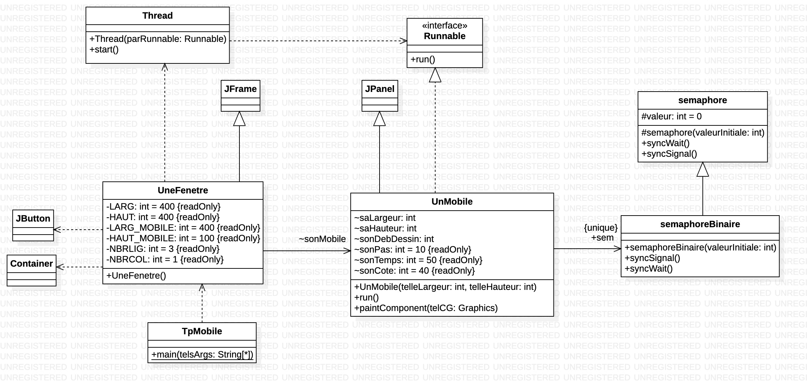
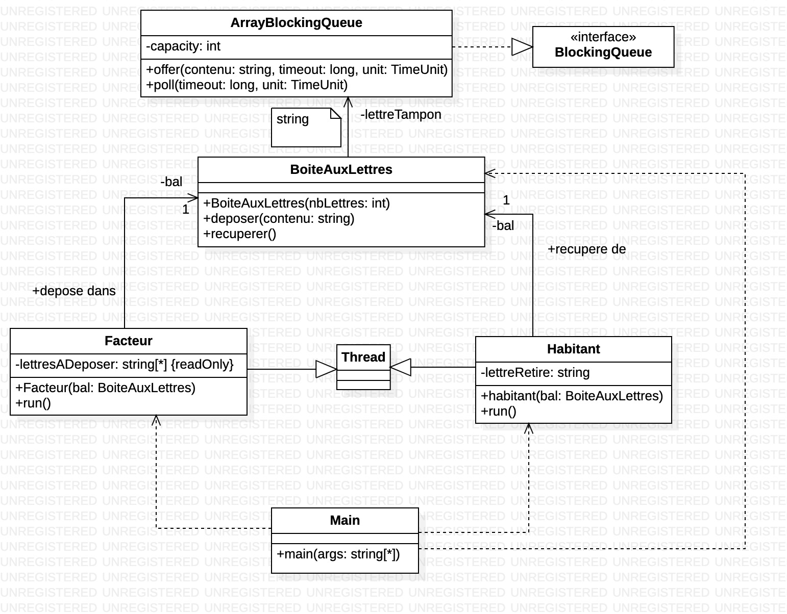

# Programmation parallèle sur machine à mémoire partagée

> Eliott Barker  
> INF3-FA  
> 2024-2025  

## Introduction

La programmation parallèle est une technique qui permet d'exécuter plusieurs tâches en même temps et de gérer les ressources critiques.  
Dans ce rapport, nous allons voir comment gérer les ressources critiques avec des semaphores et des sections critiques. Ainsi que l'utilisation du modèle producteur-consommateur.  
Une section critique est une partie du code qui ne peut être exécutée que par `x` threads à la fois.  
Une ressource critique est une ressource qui ne peut être utilisée que par `x` threads à la fois. C'est une ressource partagée entre les threads. C'est ce qui détermine la section critique.  
Un semaphore est un objet qui permet de gérer les ressources critiques et les sections critiques. Il permet de bloquer un thread si la ressource critique est déjà utilisée.  
Le modèle producteur-consommateur est un modèle qui permet de faire communiquer des threads entre eux. Il y a 3 classes : la classe qui gère la ressource critique, la classe qui produit et la classe qui consomme.  

## Architectures hardware

### Ordinateur IUT (G26)

CPU : Intel Core i7-7700 3.6GHz (4 coeurs 8 threads 8MB cache)  
RAM : 32Go DDR4  
GPU : Intel HD Graphics 630  
Stockage : SanDisk X400 512Go SSD  
OS : Atlas OS  

### Téléphone personnel

Modèle : Iphone 12  
CPU : Apple A14 Bionic (6 coeurs 2x3.1GHz 4x1.8GHz 16MB cache) ARM 64 bits  
RAM : 4 GO  

## Conception

### Mobile

  
**Figure 1** : Diagramme de classes du mobile  

Je crée la classe `semaphore` qui est abstraite et qui contient les méthodes `wait` et `signal`.  
Je crée la classe `semaphoreBinaire` qui hérite de `semaphore` et qui contient aussi les méthodes `wait` et `signal`.  
Je crée la classe `UnMobile` qui implémente `Runnable` et qui contient les méthodes `UnMobile`, `run` et `paintComponent`. Le classe `UnMobile` hérite de `JPanel` et utilise `semaphoreBinaire`.  
Je crée la classe `UneFenetre` qui hérite de `JFrame` et qui contient la méthode `UneFenetre`. La classe `UneFenetre` utilise `UnMobile`. Elle a une dépendance avec `JButton`, `Container` et `Thread`.  
Je crée la classe `TpMobile` qui contient la méthode `main`. La classe `TpMobile` utilise `UneFenetre`. C'est le point d'entrée de l'application.  

### Affichage

  
**Figure 2** : Diagramme de classes de l'affichage  

Je crée la classe `semaphore` qui est abstraite et qui contient les méthodes `wait` et `signal`.  
Je crée la classe `semaphoreBinaire` qui hérite de `semaphore` et qui contient la méthode `syncSignal`.  
Je crée la classe `Affichage` qui hérite de `Thread` et qui contient les méthodes `Affichage` et `run`. La classe `Affichage` utilise `semaphoreBinaire`.  
Je crée la classe `Main` qui contient la méthode `main`. La classe `Main` utilise `Affichage`. C'est le point d'entrée de l'application.  

### BAL


**Figure 3** : Diagramme de classes de la boite aux lettres  

Je crée la classe `BoiteAuxLettres` qui contient les méthodes `deposer` et `retirer`.  
Je crée la classe `Facteur` qui hérite de `Thread` et qui contient les méthodes `Facteur` et `run`. La classe `Facteur` utilise `BoiteAuxLettres`.  
Je crée la classe `Habitant` qui hérite de `Thread` et qui contient les méthodes `Habitant` et `run`. La classe `Habitant` utilise `BoiteAuxLettres`.  
Je crée la classe `Main` qui contient la méthode `main`. La classe `Main` utilise `Facteur`, `Habitant` et `BoiteAuxLettres`. C'est le point d'entrée de l'application.  

## Affichage d'un mobile

```java
Container leConteneur = getContentPane();
sonMobile = new UnMobile(LARG, HAUT);
leConteneur.add(sonMobile);
setSize(LARG, HAUT);
setVisible(true);
```

Ce code permet d'afficher un mobile dans une fenêtre en précisant sa largeur et sa hauteur.  
Il faut bien le rendre visible pour qu'il s'affiche.  

## Start d'un thread

```java
Thread laTache= new Thread(sonMobile);
laTache.start();
```

Pour lancer un thread, il faut l'instancier avec un objet `Runnable` et appeler ensuite la méthode `start`.

## Modification du comportement du mobile

Pour modifier le comportement du mobile, il faut bien modifier la méthode `run` de la classe `UnMobile`.  
C'est cette méthode qui est appelée lorsqu'on lance le thread et qui donc exécute le processus du mobile.

## Analyse de la ressource critiques et section critique

Les threads ne doivent pas écrire en même temps sur le terminal. La ressource critique est donc `System.out`.  
Il y a une boucle et il ne faut pas que les threads se superposent. La section critique est donc la boucle.  

Pour définir une section critique en Java, on utilise le mot-clé `synchronized`.  

```java
static Exclusion exclusionMutuelle = new Exclusion();

// ...

synchronized (exclusionMutuelle) //section critique
{
    //code
}
```

Si on a trouvé la ressource critique on peut aussi faire comme ça :

```java
synchronized (System.out) //section critique
{
    //code
}
```

La méthode `synchronized` permet d'avoir qu'un seul thread qui peut accéder à la section critique à la fois.  

## Semaphores

Les semaphores fonctionnent avec 2 états : `wait` et `signal`.  
`wait` permet de bloquer un thread si la ressource critique est déjà utilisée.  
`signal` permet de débloquer un thread qui attend la ressource critique.  

```java
static semaphoreBinaire sem = new semaphoreBinaire(1);

// ...

sem.wait(); //section critique

// CODE

sem.signal(); //fin de la section critique
```

La première ressource qui passe par `sem.wait()` va pouvoir accéder à la section critique. Les autres attendent que la ressource soit libérée. Quand la ressource passe par `sem.signal()`, un thread qui attend la ressource va pouvoir accéder à la section critique.  

Il faut que `sem` soit en `static` puisqu'il doit être partagé entre les threads.

## semaphore - Classe

Dans la classe `semaphore`, l'incrément et le décrément indique le nombre de ressources disponibles.  
Par défaut il y a `x` ressources disponibles, quand une ressource utilise la section critique, le nombre de ressources disponibles est décrémenté. Quand cette ressource a fini d'utiliser la section critique, le nombre de ressources disponibles est incrémenté.  

Quand le nombre de ressources disponibles est à 0, les autres ressources qui veulent accéder à la section critique sont bloquées. Elles attendent dans une boucle que le nombre de ressources disponibles soit supérieur à 0.  

## semaphoreBinaire

Pour afficher les indications suivantes :

```text
j’entre en section critique
je sors de la section critique
```

Il faut ajouter un `System.out.println()` dans la méthode `wait()` et `signal()` de `semaphoreBinaire` (il faut donc refaire une méthode hérité de `wait()` de `semaphore` dans `semaphoreBinaire`).  
Pour le `System.out.println("j’entre en section critique");`, il faut le mettre après le `sem.wait();` et pour le `System.out.println("je sors de la section critique");`, il faut le mettre avant le `sem.signal();`.  
Pour le premier cas, il faut le mettre après parce qu'il boucle dans `sem.wait()` et donc si il passe cette instruction c'est qu'il est entré dans la section critique.  
Pour le deuxième cas, il faut le mettre avant parce que quand il donne le signal, il sort et une autre ressource peut rentrer directement dans la section critique. Notre message risque de s'afficher en même temps que le message de la ressource qui rentre dans la section critique.  

## Avoir plusieurs mobiles sur la même fenêtre

On peut utiliser un `GridLayout` pour indiquer le nombre de lignes et de colonnes qu'on veut sur notre fenêtre.

```java
Container leConteneur = getContentPane();
leConteneur.setLayout (new GridLayout(NBRLIG, NBRCOL));
```

## Intégration des semaphores dans le mobile

Pour intégrer les semaphores dans le mobile, il faut faire 6 boucles `for` pour définir les 6 sections de la fenêtre :

- 0 -> 1/3 : allé
- 1/3 -> 2/3 : section critique allé
- 2/3 -> 3/3 : fin de l'allé
- 3/3 -> 2/3 : retour
- 2/3 -> 1/3 : section critique retour
- 1/3 -> 0 : fin du retour

La boucle qui va de 1/3 à 2/3 est une section critique avec la boucle qui va de 2/3 à 1/3.  
La ressource critique est `JPanel`.  

Pour voir l'application du semaphore, on peut rendre aléatoire le temps des mobiles.

```java
Random random = new Random();
sonTemps = random.nextInt(60 + 10) + 10;
```

## Semaphore Naire

Le semaphore naire est un semaphore qui peut être pris par plusieurs threads en même temps.  
Il faut simplement créer une classe qui hérite de `semaphore`. On ne peut pas directement utiliser la classe `semaphore` car elle est abstraite.  
Ensuite dans le mobile, on peut indiquer le nombre de threads qui peuvent prendre le semaphore en même temps.

## Synchronisation des mobiles - synchronized

Pour déclarer la section critique, on peut utiliser le mot-clé `synchronized` pour que les mobiles ne puissent pas accéder à la ressource critique en même temps. La ressource critique est `JPanel` mais `JPanel` est une instance de la classe et non la classe. Il faut donc utiliser `JPanel.class` pour déclarer la section critique.

```java
synchronized(JPanel.class) {
    // Section critique
}
```

## Utilisation du modèle producteur-consommateur

Le modèle producteur-consommateur consiste à avoir 3 classes :  

- La classe qui gère la ressource critique, ici `BoiteAuxLettres`  
- La classe qui produit, ici `Facteur`  
- La classe qui consomme, ici `Habitant`  

La classe `BoiteAuxLettres` est la classe qui contient la ressource critique, la lettre `String`. La boite aux lettres propose les services `deposer` et `retirer`.  
La classe `Facteur` s'occupe de déposer des lettres dans la boite aux lettres mais qu'une lettre est possible par boite aux lettres.  
La classe `Habitant` s'occupe de lire les lettres dans la boite aux lettres. Si la boite aux lettres est vide, il lit `null`.  

## N'arrêter le producteur et le consommateur que si la lettre est `Q`

Pour arrêter le producteur et le consommateur quand la lettre est "Q", il faut ajouter une fonction qui permet de savoir si la boite aux lettres est disponible et faire boucler les threads. Quand la lettre "Q" est rencontrée, il faut intérrompre les threads.  

BAL :

```java
public boolean estDisponible()
{
    return estDisponible;
}
```

Facteur :

```java
while (true)
{
    while (!bal.estDisponible())
    {
        sleep(1000);
    }
    System.out.println("Entrez la lettre à déposer : ");
    lettreADeposer = System.console().readLine();
    if (lettreADeposer.equals("Q"))
    {
        System.out.println("Fin du dépôt de lettres");
        Thread.currentThread().interrupt();
    }
    else
    {
        bal.deposer(lettreADeposer);
        System.out.println("Depot de la lettre : " + lettreADeposer);
    }
}
```

Habitant :

```java
while (true)
{
    while (bal.estDisponible())
    {
        sleep(1000);
    }
    lettreRetire = bal.retirer();
    if (lettreRetire.equals("Q"))
    {
        System.out.println("Fin de la récupération de lettres");
        Thread.currentThread().interrupt();
    }
    else
    {
        System.out.println("Lettre récupéré : " + lettreRetire);
    }
}
```

## Interface graphique

Pour l'interface graphique, on peut faire une fenêtre simple avec un `JTextArea` pour la lettre à déposer, 2 `JButton` pour déposer et retirer la lettre et un `JLabel` pour afficher la lettre récupérée ou les erreurs obtenues.  

Pour utiliser le `JLabel` depuis le producteur et le consommateur, j'ai créé une méthode `setLettreLabel` qui est static et `synchronized` pour que les threads ne puissent pas accéder à la ressource critique en même temps. La ressource critique est le `JLabel` et la section critique est :

```java
lettreLabel.setText(message);
```

## Utilisation d'un tampon - Tableau

Pour l'utilisation d'un tampon, on fait un tableau de `String` de taille `x` défini à la création de la classe.  
On a un pointeur `tete` qui indique la position de la tête du tampon et un pointeur `queue` qui indique la position de la queue du tampon. On a aussi un indicateur `capacite` qui indique la taille du tampon et `charge` qui indique le nombre de lettre déjà présente.  
On va aussi utiliser les méthodes `wait` et `notify` pour gérer les threads et l'attente à la ressource critique. Dans ce cas, il y a plusieurs ressources critiques : le tampon, la tête, la queue et la charge.  

BoiteAuxLettres :

```java
public synchronized void deposer(String contenu) throws InterruptedException
{
    while (charge == capacite)
    {
        wait(); // On attend que la bal soit déchargée
    }
    lettreTampon[queue] = contenu;
    queue = (queue + 1) % capacite;
    charge++;
    notifyAll(); // On notifie qu'une lettre a été déposée
    print(lettreTampon);
}

public synchronized String retirer() throws InterruptedException
{
    while (charge == 0)
    {
        wait(); // On attend qu'une lettre soit déposée
    }
    String lettre = lettreTampon[tete];
    tete = (tete + 1) % capacite;
    charge--;
    notifyAll(); // On notifie qu'une lettre a été retirée
    print(lettreTampon);
    return lettre;
}
```

On est obligé de boucler sur `wait` pour éviter les faux réveils. Les méthodes `wait` et `notify` se partagent entre 2 process : le dépôt et le retrait.  

On peut utiliser une fonction `print` pour afficher le tampon et vérifier que le dépôt et le retrait se font bien.

## Utilisation d'un tampon - ArrayBlockingQueue

Pour l'utilisation d'un tampon automatique, on peut utiliser la classe `ArrayBlockingQueue` qui est une file d'attente de taille fixe.  
Cette classe permet de bloquer l'accès à l'objet si il est déjà utilisé. Ainsi, c'est l'objet qui devient un moniteur.  

BoiteAuxLettres :

```java
public boolean deposer(String contenu) throws InterruptedException
{
    return lettreTampon.offer(contenu, 1, java.util.concurrent.TimeUnit.SECONDS);
}

public String retirer() throws InterruptedException
{
    return lettreTampon.poll(1, java.util.concurrent.TimeUnit.SECONDS);
}

public int getNbLettres()
{
    return lettreTampon.size();
}
```

Facteur :

```java
for (String lettreADeposer : lettresADeposer)
{
    boolean estDeposee = false;
    while (!estDeposee)
    {
        Thread.sleep(1000); // 1 seconde
        estDeposee = bal.deposer(lettreADeposer);
        System.out.println("Lettre déposé : " + lettreADeposer);
    }
}
System.out.println("Fin du dépôt de lettres");
System.out.println("[" + Thread.currentThread().getName() +  "] je m'arrête");
```

Habitant :

```java
while (true)
{
    Thread.sleep(1500); // 1.5 secondes
    lettreRetire = bal.retirer();
    if (lettreRetire.equals("*"))
    {
        System.out.println("Fin de la récupération de lettres");
        Thread.currentThread().interrupt();
    }
    else if (lettreRetire == null)
    {
        // Pas de lettre dans la boite aux lettres
    }
    else
    {
        System.out.println("Lettre récupéré : " + lettreRetire);
    }
}
```

On peut aussi retirer le `while (!estDeposee)` dans le producteur mais à ce moment là toutes les lettres ne seront pas déposées. Quand la boite aux lettres est pleine ou utilisée, on passera à la lettre suivante.  

On n'a plus besoin de `synchronized` car c'est la classe `ArrayBlockingQueue` qui gère les ressources critiques.  

## Conclusion

Nous avons donc vu qu'il y a plusieurs méthodes pour gérer les ressources critiques et les sections critiques.  
Les semaphores permettent de gérer les ressources critiques et les sections critiques.  
Le modèle producteur-consommateur permet de faire communiquer des threads entre eux.  
Il y a plusieurs méthodes pour gérer les ressources critiques et les sections critiques. Les méthodes doivent être choisies en fonction du besoin et de la situation.  
