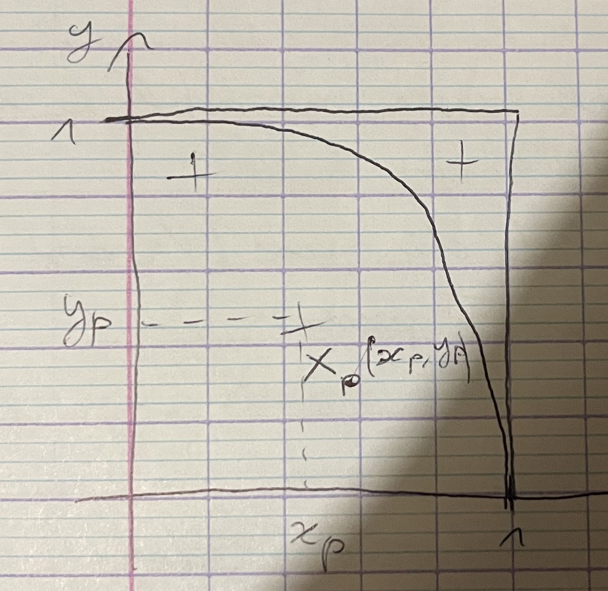
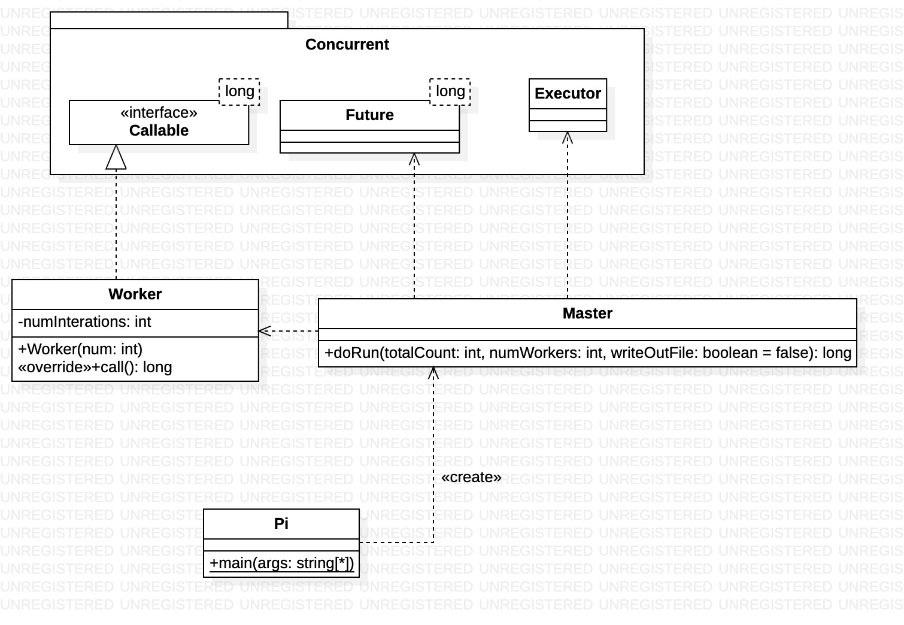
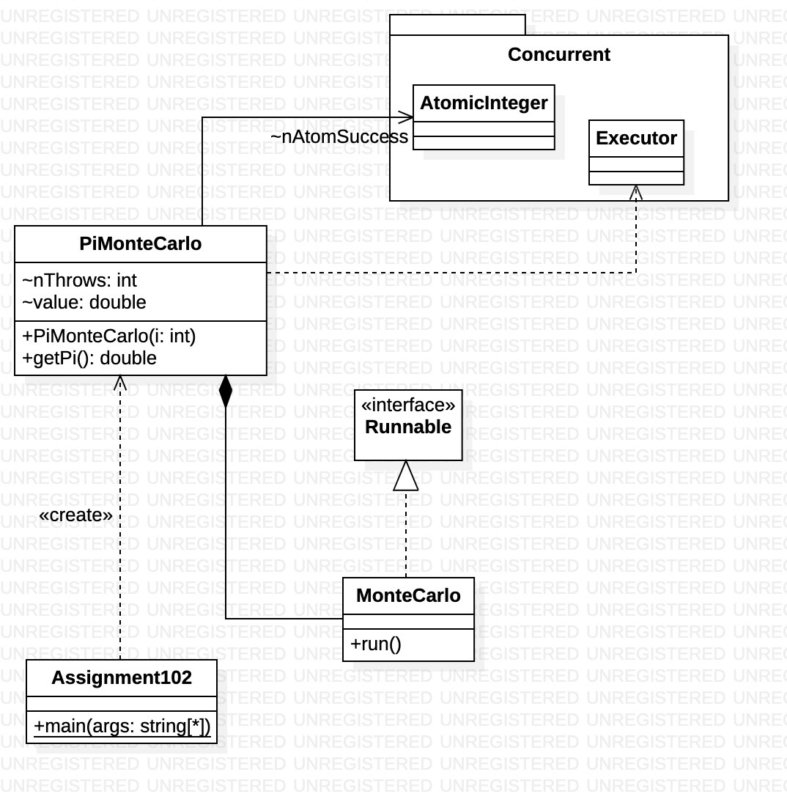
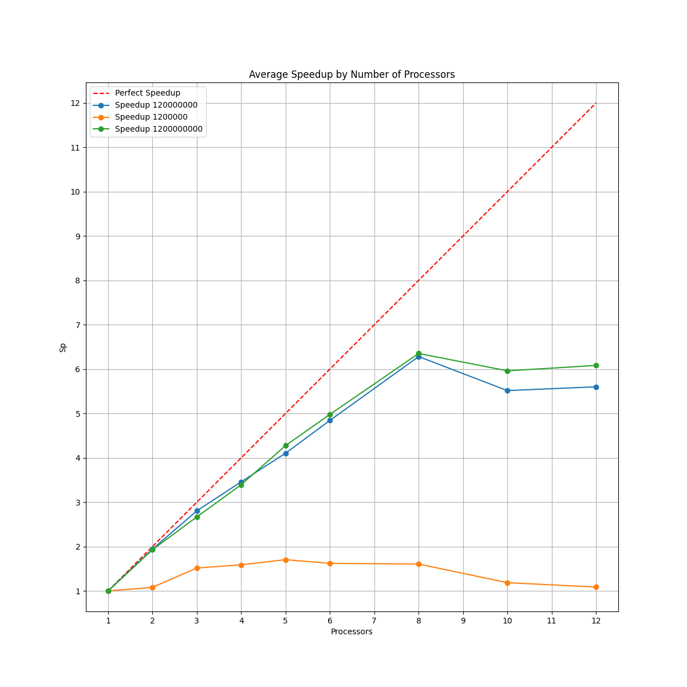
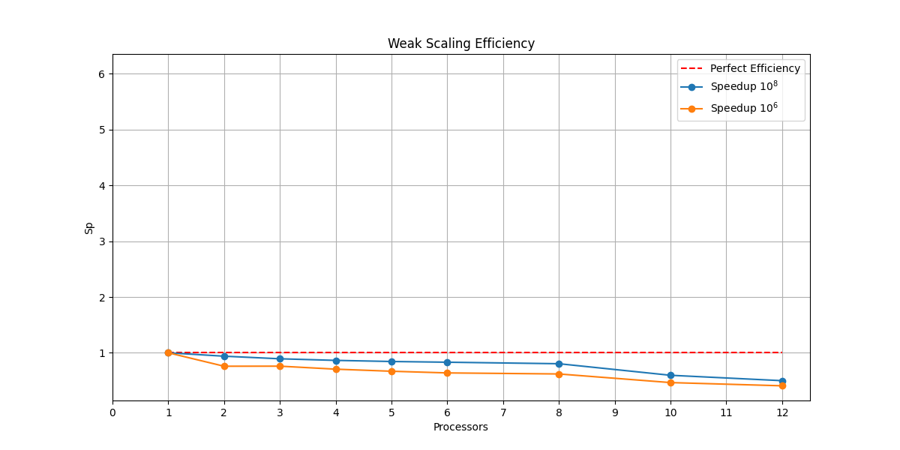
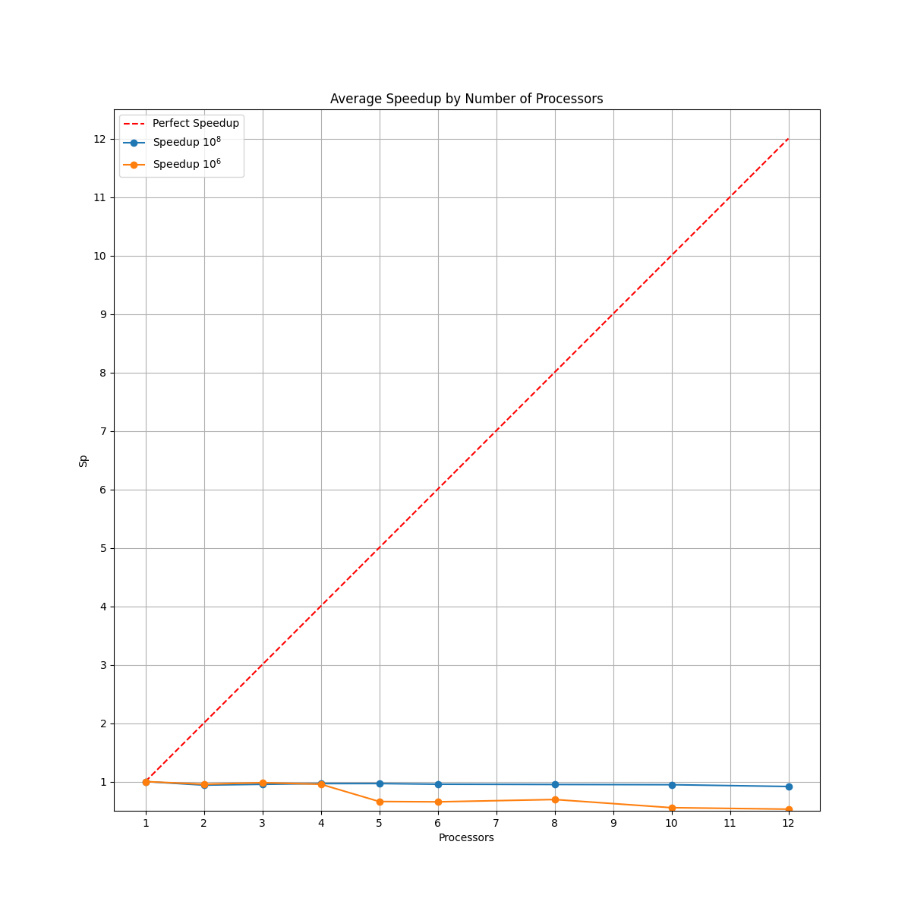
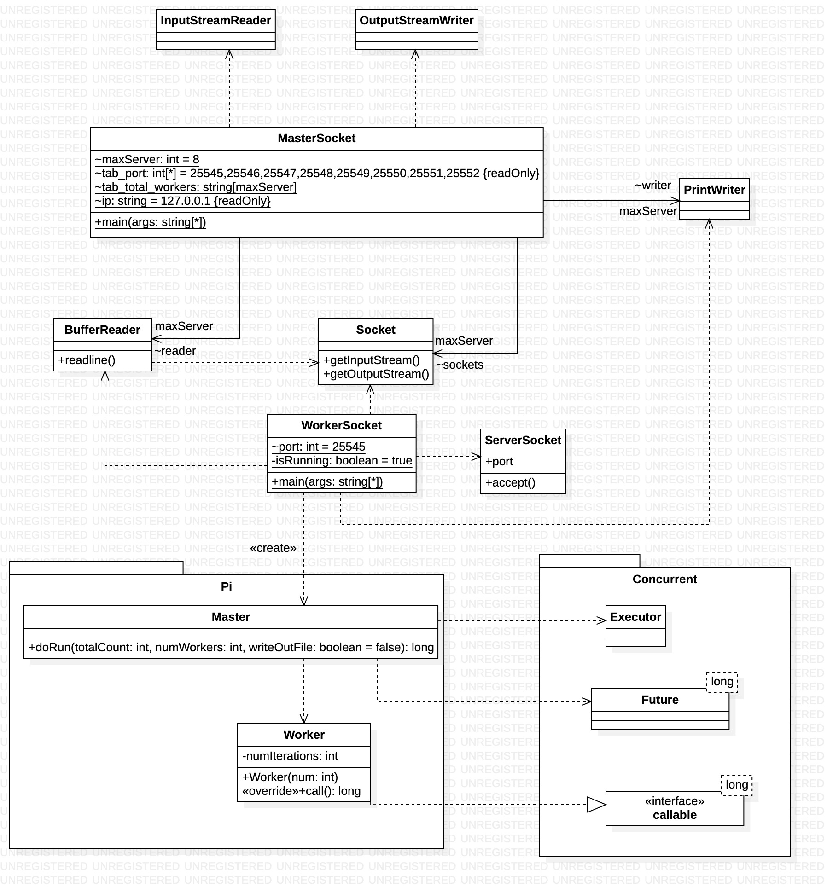

# Modèles et paradigmes de programmation parallèle

> Eliott Barker  
> INF3-FA  
> 2024-2025  

- [Introduction](#introduction)
- [Calcul de $\\Pi$ par une méthode de Monte Carlo (MC)](#calcul-de-pi-par-une-méthode-de-monte-carlo-mc)
  - [I. Généralités](#i-généralités)
  - [II. Parallélisation](#ii-parallélisation)
- [Shared](#shared)
  - [Conception](#conception)
    - [Pi](#pi)
    - [Assignment](#assignment)
  - [Assignment102 - PiMonteCarlo](#assignment102---pimontecarlo)
  - [Pi - PiMonteCarlo](#pi---pimontecarlo)
  - [Performance des programmes parallèle](#performance-des-programmes-parallèle)
    - [Strong scaling](#strong-scaling)
      - [Calcul accélération de Pi](#calcul-accélération-de-pi)
      - [Calcul accélération de Assignment102](#calcul-accélération-de-assignment102)
    - [Weak scaling](#weak-scaling)
  - [Calcul des performances](#calcul-des-performances)
    - [Scalabilité forte Pi.java](#scalabilité-forte-pijava)
    - [Scalabilité faible Pi.java](#scalabilité-faible-pijava)
    - [Scalabilité forte Assignment102.java](#scalabilité-forte-assignment102java)
- [Master Worker w Socket](#master-worker-w-socket)
  - [Analyse](#analyse)
    - [MasterSocket](#mastersocket)
    - [WorkerSocket](#workersocket)
  - [Calcul de $\\Pi$ par MC](#calcul-de-pi-par-mc)
  - [Message à renvoyer](#message-à-renvoyer)
  - [Reception du message](#reception-du-message)
  - [Socket](#socket)
  - [Réutilisation de Pi](#réutilisation-de-pi)
  - [Automatisation de MasterSocket et WorkerSocket](#automatisation-de-mastersocket-et-workersocket)
- [Conclusion](#conclusion)

## Introduction

## Calcul de $\Pi$ par une méthode de Monte Carlo (MC)

### I. Généralités

Méthode tiré du casino de Monaco, symbole du hasard.  
Utilisé pour le calcul scientifique.  

Pour $\Pi$ :  


*Figure 1*  

La probabilité qu'un point tombe dans le $1/4$ de disque :  
$P = \frac{A_{(1/4)d}}{A_{c}} = \frac{\frac{1}{4}\Pi r^2}{r^2} = \frac{\Pi}{4}$  
$P \approx \frac{n_{cible}}{n_{total}}$
$=> \Pi \simeq 4 * \frac{n_{cible}}{n_{total}}$

$X_{p}(x_{p}, y_{p})$  
$d = \sqrt{x_{p}^2 + y_{p}^2}$  
Condition : $d \leq 1$  

Soit un carré de coté 1  
Soit un quart de disque de rayon r = 1  

L'aide du carré s'écris :  
$A_{c} = r^2 = 1$  
L'aire du quart de disque s'écris :  
$A_{d/4} = \frac{\Pi r^2}{4} = \frac{\Pi}{4}$  

*Figure 1* illustre le tirage aléatoire de points $X_{p}$ de coordonnées $(x_{p}, y_{p})$ où $x_{p}$ et $y_{p}$ suivent une loi $U(]0;1[)$.  
La probabilité qu'un point $X_{p}$ soit dans le quart de disque est telle que :  
$P(X_{p} | d_{p}<1) = \frac{A_{d/4}}{A_{c}} = \frac{\Pi}{4}$  
On effectue $n_{total}$ tirages. Si $n_{total}$ est grand alors on approche :  
$P(X_{p} | d_{p}<1) \approx \frac{n_{cible}}{n_{total}}$ avec $n_{cible}$ le nombre de points dans le quart de disque (la cible).  
On peut donc approcher $\Pi$ par :  
$\Pi \approx 4 * \frac{n_{cible}}{n_{total}}$  
On écrit l'algorithme 1 permettant de calculer $\Pi$ de cette manière.  

**Algorithme 1 :** MC

```text
n_cible = 0
p = 0
tant que p < n_total
    x = rand(0,1)
    y = rand(0,1)
    si x^2 + y^2 <= 1 alors
        n_cible++
    p++
fin tant que
pi = (n_cible / n_total) * 4
```

### II. Parallélisation

On choisi un modèle de parallélisation par tâches.  

1) les tâches :  
   1) compter le nombre de n_cible  
   2) calculer pi  
2) les sous-tâches :  
   1) - générer xi *(n_total sous tâches)*  
     - générer yi  
     - incrémenter n_cible si d<1  
   2) calculer pi  
3) les dépendances :  
la tâche 2) dépend de la tâche 1)  
n_cible est une ressource critique  
1\) est une boucle parallèle  

Le temps d'accès aux données est plus long que le temps nécessaire à l'exécution d'une itération. On va donc paralléliser des sous boucles afin de faire plusieurs opérations par tâche.  
=> On change le grain des tâches  

**Algorithme 2 :**  

```text
boucle parallèle de 0 à n_total
    x = rand(0,1)
    y = rand(0,1)
    si x^2 + y^2 <= 1 alors # Section critique
        n_cible++ # Section critique + ressource critique
fin boucle
pi = (n_cible / n_total) * 4
```

**Algorithme 3 :**  

```text
boucle parallèle de 0 à n_total/100
    boucle de 0 à 100
        x = rand(0,1)
        y = rand(0,1)
        si x^2 + y^2 <= 1 alors # Section critique
            n_cible++ # Section critique + ressource critique
    fin boucle
fin boucle
pi = (n_cible / n_total) * 4
```

ou

```text
nbworkers = 100
ntw = n_total / nbworkers
ncible_array[nbworkers]
pour i=0 : ntw-1 # Worker[k]
    generer (xi, yi) # Séquentiel (1)
    compter -> {ncible_array[k]++} # Séquentiel (1)
fin pour
sommer ncible_array dans n_cible (2)
calculer pi (3)
```

## Shared

### Conception

#### Pi

  
**Figure 2** : Diagramme de classes de Pi  

#### Assignment


**Figure 3** : Diagramme de classes de Assignment

### Assignment102 - PiMonteCarlo

Dans `PiMonteCarlo`, notre `n_cible` du pseudo-code est `nAtomSuccess`.  
:warning: `worker` n'est pas un worker du paradigme `Master-Worker` mais seulement un runnable, donc une tâche.  
AtomicInteger est un objet qui protège notre entier, c'est un moniteur.  

La fonction `getPi()` est la fonction qui effectue la méthode de Monte Carlo.  

`ExecutorService` est un support de thread et `Thread` est un support de tâche.  
`Executors.newWorkStealingPool()` permet de créer un pool (un groupe) de threads et quand un thread termine, il n'est pas détruit mais réutilisé.  

### Pi - PiMonteCarlo

Le code suit un paradigme `Master-Worker`.  
`Callable` est une fonction paramétré qui retourne une valeur précisée, contrairement à `Runnable` qui retourne `void`.  

Cette fois ci, on utilise `Executors.newFixedThreadPool(numWorkers)` qui permet de créer un groupe de threads de la taille précisée.  
On stocke les résultats obtenu dans une liste de `Future<Long>`. Cette liste est une liste de résultats futurs. Derrière on récupère les résultats avec `future.get()`. Il récupère les résultats d'un thread, on ne sait pas quand est-ce qu'on va les récupérer.  

### Performance des programmes parallèle

#### Strong scaling

##### Calcul accélération de Pi

| Processus | Nombre d'intérations |
| :-------: | -------------------- |
|   p = 1   | ntot itérations      |
|   p = 2   | ntot/2 itérations    |
|     p     | ntot/p itérations    |

Temps d'exécution :

${T_1 = ntot * T_i}$  

${T_2 = \frac{ntot}{2} * T_i}$  

${T_p = \frac{ntot}{p} * T_i}$

##### Calcul accélération de Assignment102

| Processus | Nombre d'intérations                              |
| :-------: | ------------------------------------------------- |
|   p = 1   | ntot itérations                                   |
|   p = 2   | ntot/2 itérations géré par 1 processus + 3/4 ntot |
|     p     | ntot/p + 3/4 ntot                                 |

Temps d'exécution :

${T_1 = ntot * T_i}$  

${T_2 =  \frac{ntot}{2} * T_i + \frac{3}{4} * ntot}$  

${T_p = \frac{ntot}{p} * T_i + \frac{3}{4} * ntot}$

=> ${T_p > T_1}$  
${S_p = \frac{T_1}{T_P} < 1}$

#### Weak scaling

On fixe la taille / la charge par processus.  

${T_1 \simeq T_p}$

=> ${S_p \simeq 1}$

*(insérer courbe)*  

La courbe verte reste proche de 1 en fonction du nombre de processus (un ordinateur avec 4 coeurs aura une cours de 1 jusque 4 et après ça redescend doucement).

### Calcul des performances

#### Scalabilité forte Pi.java


**Figure 4** : Scalabilité forte de Pi.java

On remarque qu'au dessus de 8 processeurs pour les courbes verte et bleu le speedup est moins important. Cela est normal puisque l'ordinateur n'a que 4 coeurs et 8 threads.  

On peut voir qu'avec 1 200 000 lancés le speedup est vraiment bas. Cela montre que le temps d'accès aux données est plus long que le temps nécessaire à l'exécution d'une itération donc la parallélisation n'est pas efficace. Cela s'explique parce que l'ordinateur a 3.6GHz soit 3.6 milliards cycles par seconde.  

Au fur et à mesure la coubre bleu et la courbe verte s'écartent de la courbe idéale. Cela est normal puisque c'est le système d'exploitation qui gère le placement des processus sur les coeurs.  

#### Scalabilité faible Pi.java


**Figure 5** : Scalabilité faible de Pi.java

Pour la scalabilité faible de Pi.java, on peut voir que si on fixe le nombre d'itérations à 120 000 000 par processus, le speedup est proche de 1 jusque 8 processeurs. Ensuite il redescend.  
C'est pareil avec 1 200 000 itérations par processus mais le speedup est plus bas pour les mêmes raisons que la scalabilité forte.  

On ne peut pas faire cette expérience avec 1 200 000 000 itérations par processus car on tombera dans une erreur de type `OutOfMemoryError` de la part de la JVM. En effet, la JVM va allouer de la mémoire pour chaque processus même si on n'utilise pas de tableau.  

#### Scalabilité forte Assignment102.java


**Figure 6** : Scalabilité forte de Assignment102.java

La scalabilité forte de Assignment102 est très mauvaise. On voit même qu'elle est presque pareil que la scalabilité faible de Pi.java. De plus, on voit que la courbe bleu est presque constante même au dessus des 8 processus. La courbe orange, elle, chute à 4 processus.  

Cela montre que la parallélisation de ce code n'est pas efficace.  

Le nombre d'itérations s'arrête à 120 000 000. Puisque le temps d'exécution est très long vu que la parrallélisation n'est pas efficace.  

## Master Worker w Socket

### Analyse


**Figure 7** : Diagramme de classes de Suite

#### MasterSocket

Dans un premier temps, le master s'occuper d'initialiser tous les workers pour ensuite créer leur socket. Il défini le l'ip et le port de chacun et ajoute un `reader` et un `writer` pour chaque worker.  
Puis il va envoyer un message à chaque worker pour leur dire le nombre d'itération à faire. Une fois cela fait il va lire tous les résultats des workers. Une fois lu, il va faire le calcul de Pi grâce aux données reçues.  

Pour finir il indique à tous les workers de s'arrêter et ferme les sockets.  

#### WorkerSocket

Le worker va initialiser un ServerSocket avec le port donné par le master.  
Il va instancier un `reader` et un `writer` pour communiquer avec le master.  
Ensuite, il va attendre le message du master afin de faire le travail demandé.

- Si le message est `y`, le worker va générer des points et renvoyer le nombre de points dans le quart de disque.  
- Si le message est `END` le worker va stopper la communication avec le master et fermer le socket.  

### Calcul de $\Pi$ par MC

Dans le worker, il faut ajouter ce code après la récupération du message du master :  

```java
int totalCount = Integer.parseInt(str);
int ncible = 0;
for (int i = 0; i < totalCount; i++) {
    double x = Math.random();
    double y = Math.random();
    if (x * x + y * y <= 1) {
        ncible++;
    }
}
```

### Message à renvoyer

Le worker doit renvoyer le nombre de points dans le quart de disque.  
Pour cela, il doit renvoyer un message de type `String` avec le nombre de points.  

```java
pWrite.println(ncible);
```

### Reception du message

Le master doit récupérer le message du worker, soit le nombre de points dans le quart de disque.  
Ensuite il a simplement à additionner tous les résultats renvoyés par les workers et faire le calcul de $\Pi$.  

```java
for (int i = 0; i < numWorkers; i++) {
    total += Integer.parseInt(tab_total_workers[i]);
}
pi = 4.0 * total / totalCount / numWorkers;
```

> :warning: il ne faut pas oublier de réinitialiser dans le master le nombre de points dans le quart de disque après chaque expérience.  

### Socket

### Réutilisation de Pi

Afin d'éviter d'avoir du code dupliqué. On peut réutiliser le package `Pi` pour obtenir le nombre de points dans la cible.  
Pour cela, il faut importer le package `TP4_Shared.Pi.Master` dans `WorkerSocket.java`. Dans la fonction `main` de `WorkerSocket`, il faut appeler la fonction `doRun()` de la classe `Master` :

```java
int totalCount = Integer.parseInt(str);
int numWorkers = 1;
long ncible = new Master().doRun(totalCount / numWorkers, numWorkers);

pWrite.println(ncible); // send number of points in quarter of disk
```

Premièrement cela permet de réutiliser du code existant. Mais cela permet aussi d'implémenter du parallélisme à 2 niveaux. Le premier niveau met en parallèle les différentes machines et le deuxième niveau met en parallèle les différents coeurs de chaque machine.

### Automatisation de MasterSocket et WorkerSocket

Pour automatiser le lancement de `MasterSocket` et `WorkerSocket` pour les utiliser dans un script Python afin de calculer les performances.  
Il faut retirer la routine qui demande le nombre de Worker dans `MasterSocket` et les entrer directement dans les arguments :

```java
totalCount = Integer.parseInt(args[0]);
if (args.length > 1)
  numWorkers = Integer.parseInt(args[1]);
```

## Conclusion
