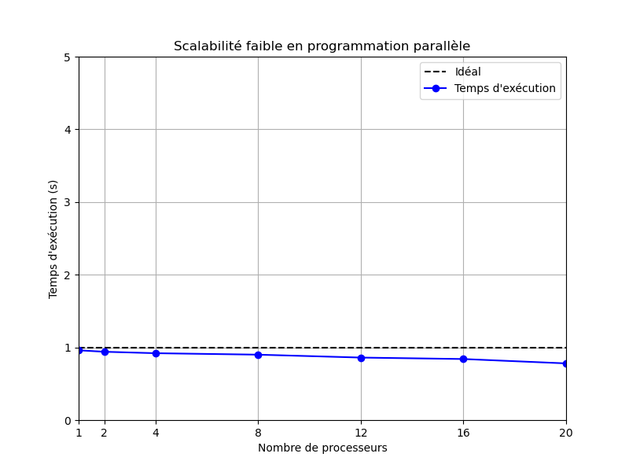
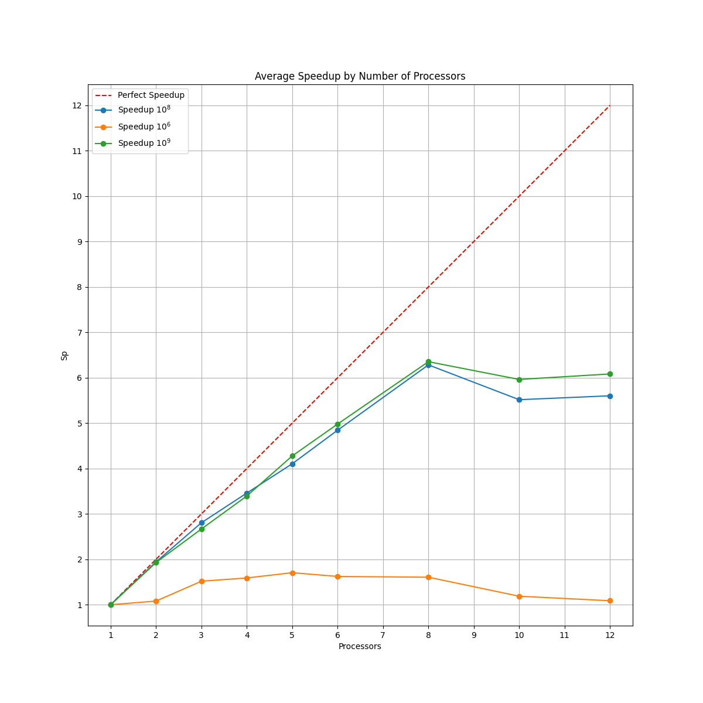
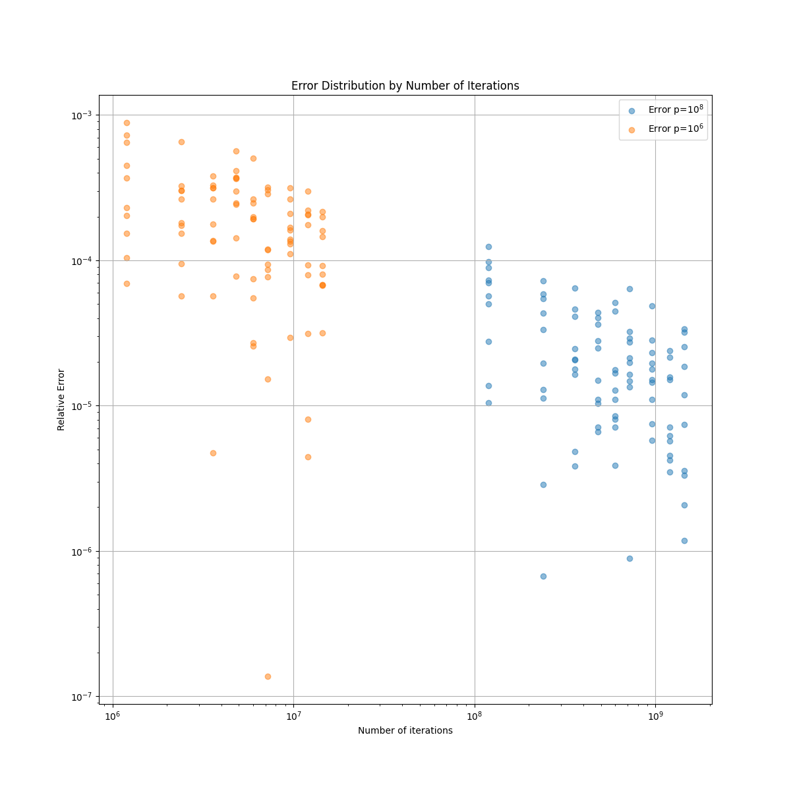
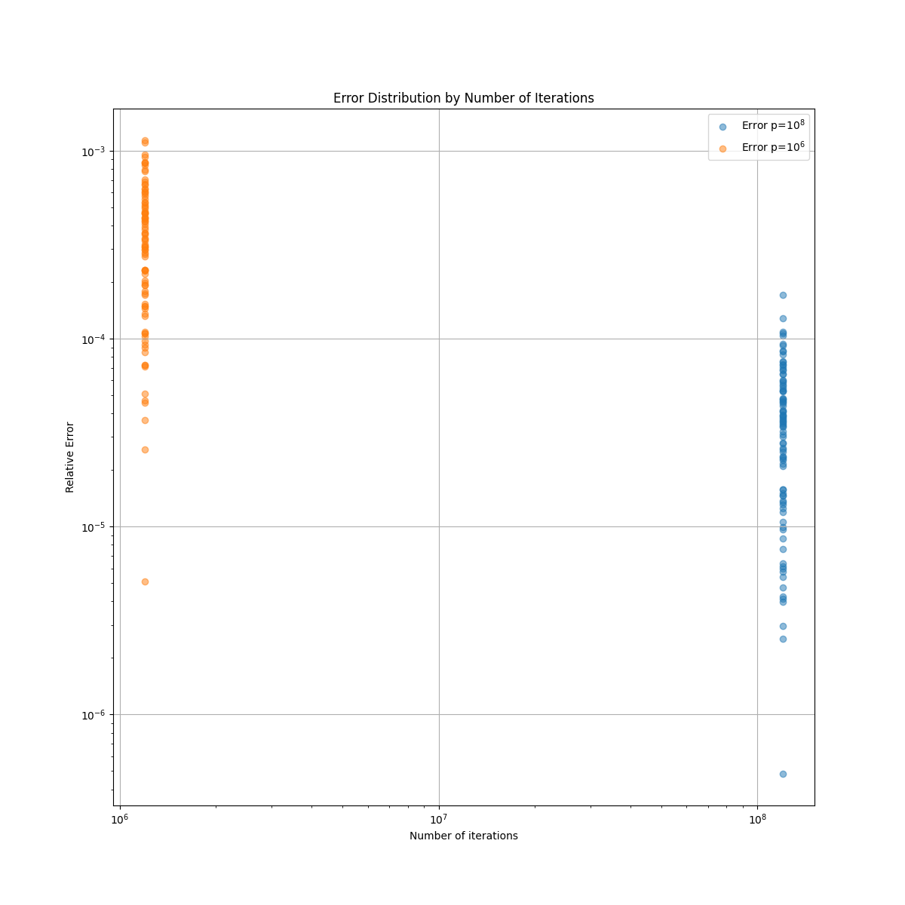

# Modèles et paradigmes de programmation parallèle

> Eliott Barker  
> INF3-FA  
> 2024-2025  

- [Introduction](#introduction)
- [Calcul de $\\Pi$ par une méthode de Monte Carlo (MC)](#calcul-de-pi-par-une-méthode-de-monte-carlo-mc)
  - [I. Généralités](#i-généralités)
  - [II. Parallélisation](#ii-parallélisation)
- [Shared](#shared)
  - [Conception](#conception)
    - [Pi](#pi)
    - [Assignment](#assignment)
  - [Assignment102 - PiMonteCarlo](#assignment102---pimontecarlo)
  - [Pi - PiMonteCarlo](#pi---pimontecarlo)
  - [Performance des programmes parallèle](#performance-des-programmes-parallèle)
    - [Strong scaling](#strong-scaling)
      - [Calcul accélération de Pi](#calcul-accélération-de-pi)
      - [Calcul accélération de Assignment102](#calcul-accélération-de-assignment102)
    - [Weak scaling](#weak-scaling)
  - [Sortie de programme](#sortie-de-programme)
  - [Calcul des performances](#calcul-des-performances)
    - [Scalabilité forte Pi.java](#scalabilité-forte-pijava)
    - [Scalabilité faible Pi.java](#scalabilité-faible-pijava)
    - [Scalabilité forte Assignment102.java](#scalabilité-forte-assignment102java)
  - [Analyse de l'erreur](#analyse-de-lerreur)
    - [Erreur de Pi.java en scalabilité forte](#erreur-de-pijava-en-scalabilité-forte)
    - [Erreur de Pi.java en scalabilité faible](#erreur-de-pijava-en-scalabilité-faible)
    - [Erreur de Assignment102.java en scalabilité forte](#erreur-de-assignment102java-en-scalabilité-forte)
- [Master Worker w Socket](#master-worker-w-socket)
  - [Analyse](#analyse)
    - [MasterSocket](#mastersocket)
    - [WorkerSocket](#workersocket)
  - [Calcul de $\\Pi$ par MC](#calcul-de-pi-par-mc)
  - [Message à renvoyer](#message-à-renvoyer)
  - [Reception du message](#reception-du-message)
  - [Socket](#socket)
  - [Réutilisation de Pi](#réutilisation-de-pi)
  - [Automatisation de MasterSocket et WorkerSocket](#automatisation-de-mastersocket-et-workersocket)
  - [Speedup et erreur](#speedup-et-erreur)
  - [Utilisation de `MasterSocket` et `WorkerSocket` sur plusieurs machines](#utilisation-de-mastersocket-et-workersocket-sur-plusieurs-machines)
- [Performance des mesures](#performance-des-mesures)
  - [Efficacité du temps de processus](#efficacité-du-temps-de-processus)
- [Travail en entreprise](#travail-en-entreprise)
- [Conclusion](#conclusion)

## Introduction

Dans le cadre de l'informatique moderne, où les calculs sont de plus en plus complexes, il est nécessaire de paralléliser les programmes.  
Nous allons étudier dans ce rapport la parallélisation à travers différents modèles et paradigmes de programmation en mémoire partagée et distribuée.  
Afin de comparer les performances de ces différents modèles, nous allons nous baser sur le calcul de $\Pi$ par une méthode de Monte Carlo.  
Nous allons également étudier la performance des mesures de ces programmes.  

## Calcul de $\Pi$ par une méthode de Monte Carlo (MC)

### I. Généralités

Méthode tiré du casino de Monaco, symbole du hasard.  
Utilisé pour le calcul scientifique.  

Pour $\Pi$ :  


*Figure 1*  

La probabilité qu'un point tombe dans le $1/4$ de disque :  
$P = \frac{A_{(1/4)d}}{A_{c}} = \frac{\frac{1}{4}\Pi r^2}{r^2} = \frac{\Pi}{4}$  
$P \approx \frac{n_{cible}}{n_{total}}$
$=> \Pi \simeq 4 * \frac{n_{cible}}{n_{total}}$

$X_{p}(x_{p}, y_{p})$  
$d = \sqrt{x_{p}^2 + y_{p}^2}$  
Condition : $d \leq 1$  

Soit un carré de coté 1  
Soit un quart de disque de rayon r = 1  

L'aide du carré s'écris :  
$A_{c} = r^2 = 1$  
L'aire du quart de disque s'écris :  
$A_{d/4} = \frac{\Pi r^2}{4} = \frac{\Pi}{4}$  

*Figure 1* illustre le tirage aléatoire de points $X_{p}$ de coordonnées $(x_{p}, y_{p})$ où $x_{p}$ et $y_{p}$ suivent une loi $U(]0;1[)$.  
La probabilité qu'un point $X_{p}$ soit dans le quart de disque est telle que :  
$P(X_{p} | d_{p}<1) = \frac{A_{d/4}}{A_{c}} = \frac{\Pi}{4}$  
On effectue $n_{total}$ tirages. Si $n_{total}$ est grand alors on approche :  
$P(X_{p} | d_{p}<1) \approx \frac{n_{cible}}{n_{total}}$ avec $n_{cible}$ le nombre de points dans le quart de disque (la cible).  
On peut donc approcher $\Pi$ par :  
$\Pi \approx 4 * \frac{n_{cible}}{n_{total}}$  
On écrit l'algorithme 1 permettant de calculer $\Pi$ de cette manière.  

**Algorithme 1 :** MC

```text
n_cible = 0
p = 0
tant que p < n_total
    x = rand(0,1)
    y = rand(0,1)
    si x^2 + y^2 <= 1 alors
        n_cible++
    p++
fin tant que
pi = (n_cible / n_total) * 4
```

### II. Parallélisation

On choisi un modèle de parallélisation par tâches.  

1) les tâches :  
   1) compter le nombre de n_cible  
   2) calculer pi  
2) les sous-tâches :  
   1) - générer xi *(n_total sous tâches)*  
     - générer yi  
     - incrémenter n_cible si d<1  
   2) calculer pi  
3) les dépendances :  
la tâche 2) dépend de la tâche 1)  
n_cible est une ressource critique  
1\) est une boucle parallèle  

Le temps d'accès aux données est plus long que le temps nécessaire à l'exécution d'une itération. On va donc paralléliser des sous boucles afin de faire plusieurs opérations par tâche.  
=> On change le grain des tâches  

**Algorithme 2 :**  

```text
boucle parallèle de 0 à n_total
    x = rand(0,1)
    y = rand(0,1)
    si x^2 + y^2 <= 1 alors # Section critique
        n_cible++ # Section critique + ressource critique
fin boucle
pi = (n_cible / n_total) * 4
```

**Algorithme 3 :**  

```text
boucle parallèle de 0 à n_total/100
    boucle de 0 à 100
        x = rand(0,1)
        y = rand(0,1)
        si x^2 + y^2 <= 1 alors # Section critique
            n_cible++ # Section critique + ressource critique
    fin boucle
fin boucle
pi = (n_cible / n_total) * 4
```

ou

```text
nbworkers = 100
ntw = n_total / nbworkers
ncible_array[nbworkers]
pour i=0 : ntw-1 # Worker[k]
    generer (xi, yi) # Séquentiel (1)
    compter -> {ncible_array[k]++} # Séquentiel (1)
fin pour
sommer ncible_array dans n_cible (2)
calculer pi (3)
```

## Shared

Le code `Pi.java` a été écrit par Dr. Steve Kautz.  
Le code `Assignment102.java` a été écrit par Karthik Jain.  

### Conception

#### Pi

  
**Figure 2** : Diagramme de classes de Pi  

On a la classe `Worker` qui contient la méthode `Worker` et `run`. La classe implémente `Callable`.  
On a la classe `Master` qui contient la méthode `doRun`. La classe dépende de `Worker`, `Executor` et `Future`.  
On a la classe `Pi` qui contient la méthode `main`. La classe dépende de `Master`.  

#### Assignment


**Figure 3** : Diagramme de classes de Assignment

On a la classe `PiMonteCarlo` qui contient les méthodes `PiMonteCarlo` et `getPi`. La classe dépend de `Executor` et utilise `AtomicInteger`.  
On a la classe `MonteCarlo` qui contient la méthode `run`. La classe implémente `Runnable`. Cette classe est contenue dans `PiMonteCarlo`.  
On a la classe `Assignment102` qui contient la méthode `main`. La classe dépend de `PiMonteCarlo`.  

### Assignment102 - PiMonteCarlo

Dans `PiMonteCarlo`, notre `n_cible` du pseudo-code est `nAtomSuccess`.  
:warning: `worker` n'est pas un worker du paradigme `Master-Worker` mais seulement un runnable, donc une tâche.  
AtomicInteger est un objet qui protège notre entier, c'est un moniteur.  

La fonction `getPi()` est la fonction qui effectue la méthode de Monte Carlo.  

`ExecutorService` est un support de thread et `Thread` est un support de tâche.  
`Executors.newWorkStealingPool()` permet de créer un pool (un groupe) de threads et quand un thread termine, il n'est pas détruit mais réutilisé.  

### Pi - PiMonteCarlo

Le code suit un paradigme `Master-Worker`.  
`Callable` est une fonction paramétré qui retourne une valeur précisée, contrairement à `Runnable` qui retourne `void`.  

Cette fois ci, on utilise `Executors.newFixedThreadPool(numWorkers)` qui permet de créer un groupe de threads de la taille précisée.  
On stocke les résultats obtenu dans une liste de `Future<Long>`. Cette liste est une liste de résultats futurs. Derrière on récupère les résultats avec `future.get()`. Il récupère les résultats d'un thread, on ne sait pas quand est-ce qu'on va les récupérer.  

### Performance des programmes parallèle

#### Strong scaling


**Figure 4** : Scalabilité forte  

La scalabilité forte est le rapport entre le temps d'exécution sur un seul processus et le temps d'exécution sur plusieurs processus.  
La courbe idéale est une droite à 45°. Notre courbe doit être le plus proche possible de cette droite. Elle finira par stagner à cause du nombre de coeurs de l'ordinateur.  

##### Calcul accélération de Pi

| Processus | Nombre d'intérations |
| :-------: | -------------------- |
|   p = 1   | ntot itérations      |
|   p = 2   | ntot/2 itérations    |
|     p     | ntot/p itérations    |

Temps d'exécution :

${T_1 = ntot * T_i}$  

${T_2 = \frac{ntot}{2} * T_i}$  

${T_p = \frac{ntot}{p} * T_i}$

##### Calcul accélération de Assignment102

| Processus | Nombre d'intérations                              |
| :-------: | ------------------------------------------------- |
|   p = 1   | ntot itérations                                   |
|   p = 2   | ntot/2 itérations géré par 1 processus + 3/4 ntot |
|     p     | ntot/p + 3/4 ntot                                 |

Temps d'exécution :

${T_1 = ntot * T_i}$  

${T_2 =  \frac{ntot}{2} * T_i + \frac{3}{4} * ntot}$  

${T_p = \frac{ntot}{p} * T_i + \frac{3}{4} * ntot}$

=> ${T_p > T_1}$  
${S_p = \frac{T_1}{T_P} < 1}$

#### Weak scaling

On fixe la taille / la charge par processus.  

${T_1 \simeq T_p}$

=> ${S_p \simeq 1}$


**Figure 5** : Scalabilité faible

La courbe verte reste proche de 1 en fonction du nombre de processus (un ordinateur avec 4 coeurs aura une cours de 1 jusque 4 et après ça redescend doucement).

### Sortie de programme

Afin de pouvoir analyser nos codes et de pouvoir comparer les performances de parallélisation, on a défini un format de fichier de sortie :

```text
error ntotal nprocessors time
```

- `error` : erreur de calcul de $\Pi$  
- `ntotal` : nombre d'itérations total  
- `nprocessors` : nombre de processus  
- `time` : temps d'exécution en millisecondes  

On demande le temps en milisecondes puisque nous utilisons Java et que la JVM ne nous permettra pas d'avoir des programmes s'exécutant en moins de 1ms.  

### Calcul des performances

> :warning: Assignment102.java et Pi.java ne s'appellent pas de la même manière en ligne de commande.  
>
> - Assignment102.java prend en argument le nombre d'itérations total et le nombre de processus.  
> - Pi.java prend en argument le nombre d'itérations par workers et le nombre de workers.  

#### Scalabilité forte Pi.java


**Figure 6** : Scalabilité forte de Pi.java

On remarque qu'au dessus de 8 processeurs pour les courbes verte et bleu le speedup est moins important. Cela est normal puisque l'ordinateur n'a que 4 coeurs et 8 threads.  

On peut voir qu'avec 1 200 000 lancés le speedup est vraiment bas. Cela montre que le temps d'accès aux données est plus long que le temps nécessaire à l'exécution d'une itération donc la parallélisation n'est pas efficace. Cela s'explique parce que l'ordinateur a 3.6GHz soit 3.6 milliards cycles par seconde.  

Au fur et à mesure la coubre bleu et la courbe verte s'écartent de la courbe idéale. Cela est normal puisque c'est le système d'exploitation qui gère le placement des processus sur les coeurs.  

#### Scalabilité faible Pi.java


**Figure 7** : Scalabilité faible de Pi.java

Pour la scalabilité faible de Pi.java, on peut voir que si on fixe le nombre d'itérations à 120 000 000 par processus, le speedup est proche de 1 jusque 8 processeurs. Ensuite il redescend.  
C'est pareil avec 1 200 000 itérations par processus mais le speedup est plus bas pour les mêmes raisons que la scalabilité forte.  

On ne peut pas faire cette expérience avec 1 200 000 000 itérations par processus car on tombera dans une erreur de type `OutOfMemoryError` de la part de la JVM. En effet, la JVM va allouer de la mémoire pour chaque processus même si on n'utilise pas de tableau.  

#### Scalabilité forte Assignment102.java


**Figure 8** : Scalabilité forte de Assignment102.java

La scalabilité forte de Assignment102 est très mauvaise. On voit même qu'elle est presque pareil que la scalabilité faible de Pi.java. De plus, on voit que la courbe bleu est presque constante même au dessus des 8 processus. La courbe orange, elle, chute à 4 processus.  

Cela montre que la parallélisation de ce code n'est pas efficace.  

Le nombre d'itérations s'arrête à 120 000 000. Puisque le temps d'exécution est très long vu que la parrallélisation n'est pas efficace.  

### Analyse de l'erreur

Pour calculer l'erreur il faut faire le calcul suivant :  
$\epsilon = \frac{|\Pi_{exp} - \Pi_{th}|}{\Pi_{th}}$  

Où $\Pi_{exp}$ est la valeur expérimentale de $\Pi$ et $\Pi_{th}$ est la valeur théorique de $\Pi$.  

Grâce à notre fichier de sortie, que sort chaque programme, on peut dessiner les points des erreurs en fonction du nombre d'itérations. On place des points sur des log10 pour avoir une meilleure visibilité.  

Ici le calcul de l'erreur est pas très précis puisque l'algorithme de Monte Carlo est un algorithme probabiliste.  

#### Erreur de Pi.java en scalabilité forte


**Figure 9** : Erreur de Pi.java en scalabilité forte

On peut voir que l'erreur diminue à chaque fois que le nombre d'itérations augmente. Cela est normal puisque plus on a d'itérations plus on a d'expériences et donc plus les résultats sont précis.  

#### Erreur de Pi.java en scalabilité faible


**Figure 10** : Erreur de Pi.java en scalabilité faible

L'erreur en scalabilité faible est plus compliqué à analyser. Mais on peut voir ici que plus on a d'itérations plus l'erreur diminue.  

#### Erreur de Assignment102.java en scalabilité forte


**Figure 11** : Erreur de Assignment102.java en scalabilité forte

On peut voir que ici l'erreur est équivalente à celle de Pi.java pour $10^8$ itérations malgré le fait que la scalabilité est mauvaise. Cela montre que le code est correct mais que seulement la parallélisation n'est pas efficace.  

## Master Worker w Socket

### Analyse


**Figure 12** : Diagramme de classes de Suite

On a la classe `MasterSocket` qui contient la méthode `main`. La classe dépend de `InputStreamReader` et `OutputStreamWriter`. La classe utilise `PrintWriter`, `BufferedReader` et `Socket`.  
On a la classe `WorkerSocket` qui contient la méthode `main`. La classe dépend de `BufferReader`, `Socket`, `ServerSocket`, `PrintWriter` et de `Master` du package `TP4_Shared.Pi`.  

#### MasterSocket

Dans un premier temps, le master s'occuper d'initialiser tous les workers pour ensuite créer leur socket. Il défini le l'ip et le port de chacun et ajoute un `reader` et un `writer` pour chaque worker.  
Puis il va envoyer un message à chaque worker pour leur dire le nombre d'itération à faire. Une fois cela fait il va lire tous les résultats des workers. Une fois lu, il va faire le calcul de Pi grâce aux données reçues.  

Pour finir il indique à tous les workers de s'arrêter et ferme les sockets.  

#### WorkerSocket

Le worker va initialiser un ServerSocket avec le port donné par le master.  
Il va instancier un `reader` et un `writer` pour communiquer avec le master.  
Ensuite, il va attendre le message du master afin de faire le travail demandé.

- Si le message est `y`, le worker va générer des points et renvoyer le nombre de points dans le quart de disque.  
- Si le message est `END` le worker va stopper la communication avec le master et fermer le socket.  

### Calcul de $\Pi$ par MC

Dans le worker, il faut ajouter ce code après la récupération du message du master :  

```java
int totalCount = Integer.parseInt(str);
int ncible = 0;
for (int i = 0; i < totalCount; i++) {
    double x = Math.random();
    double y = Math.random();
    if (x * x + y * y <= 1) {
        ncible++;
    }
}
```

### Message à renvoyer

Le worker doit renvoyer le nombre de points dans le quart de disque.  
Pour cela, il doit renvoyer un message de type `String` avec le nombre de points.  

```java
pWrite.println(ncible);
```

### Reception du message

Le master doit récupérer le message du worker, soit le nombre de points dans le quart de disque.  
Ensuite il a simplement à additionner tous les résultats renvoyés par les workers et faire le calcul de $\Pi$.  

```java
for (int i = 0; i < numWorkers; i++) {
    total += Integer.parseInt(tab_total_workers[i]);
}
pi = 4.0 * total / totalCount / numWorkers;
```

> :warning: il ne faut pas oublier de réinitialiser dans le master le nombre de points dans le quart de disque après chaque expérience.  

### Socket

Les sockets sont des objets qui permettent de communiquer entre deux machines.  
Il y a deux types de sockets :

- `ServerSocket` : serveur qui écoute un port donnée  
- `Socket` : client qui se connecte à un serveur  

Les deux machine communiquent en envoyant des messages. Ces messages passent souvent par des buffers.  
Les sockets sont utilisées pour la communication en temps réel. Exemple : les jeux en ligne ou les chats.  

Création d'un serveur :  

```java
ServerSocket serverSocket = new ServerSocket(1234); // 1234 est le port
```

Connection à un serveur :  

```java
Socket socket = new Socket("localhost", 1234); // localhost est l'ip du serveur, 1234 est le port
```

Ici on utilise un `ServerSocket` pour le worker et un `Socket` pour le master.  
La connexion entre les 2 machines se stoppe quand le serveur coupe la communication.  

Pour communiquer des messages le `MasterSocket` va utiliser `PrintWriter` et `BufferedReader` :  

```java
PrintWriter pWrite = new PrintWriter(new BufferWriter(new OutputStreamWriter(socket.getOutputStream())), true);
BufferedReader bRead = new BufferedReader(new InputStreamReader(socket.getInputStream()));
```

Pour lire un message :  

```java
String str = bRead.readLine();
```

Pour envoyer un message :  

```java
pWrite.println("Hello World");
```

Pour le `WorkerSocket` c'est la même chose mais avec un `ServerSocket` :  

```java
PrintWriter pWrite = new PrintWriter(new BufferedWriter(new OutputStreamWriter(clientSocket.getOutputStream()), true);
BufferedReader bRead = new BufferedReader(new InputStreamReader(clientSocket.getInputStream()));
```

### Réutilisation de Pi

Afin d'éviter d'avoir du code dupliqué. On peut réutiliser le package `Pi` pour obtenir le nombre de points dans la cible.  
Pour cela, il faut importer le package `TP4_Shared.Pi.Master` dans `WorkerSocket.java`. Dans la fonction `main` de `WorkerSocket`, il faut appeler la fonction `doRun()` de la classe `Master` :

```java
int totalCount = Integer.parseInt(str);
int numWorkers = 1;
long ncible = new Master().doRun(totalCount / numWorkers, numWorkers);

pWrite.println(ncible); // send number of points in quarter of disk
```

Premièrement cela permet de réutiliser du code existant. Mais cela permet aussi d'implémenter du parallélisme à 2 niveaux. Le premier niveau met en parallèle les différentes machines et le deuxième niveau met en parallèle les différents coeurs de chaque machine.

### Automatisation de MasterSocket et WorkerSocket

Pour automatiser le lancement de `MasterSocket` et `WorkerSocket` pour les utiliser dans un script Python afin de calculer les performances.  
Il faut retirer la routine qui demande le nombre de Worker dans `MasterSocket` et les entrer directement dans les arguments :

```java
totalCount = Integer.parseInt(args[0]);
if (args.length > 1)
  numWorkers = Integer.parseInt(args[1]);
```

### Speedup et erreur

  
**Figure 13** : Scalabilité forte de Master-Worker  

La speedup de ce code est assez similaire à celle de Pi.java.  
Cela est normal puisque une partie du code est la même. De plus, le principe de parallélisation est le même, il est seulement sur une mémoire distribuée. Ici, on a fait les tests sur une seule machine.  


**Figure 14** : Scalabilité faible de Master-Worker  

De même pour la scalabilité faible, elle est similaire à celle de Pi.java.  


**Figure 15** : Erreur de Master-Worker  

L'erreur a tendance à diminuer un peu quand on augmente le nombre d'itérations. Ce qui nous rend plus précis.  


**Figure 16** : Erreur de Master-Worker en scalabilité faible

L'erreur en scalabilité faible est plus compliqué à analyser. Ici on peut voir que les les erreurs sont assez basses au début des itérations mais qu'elles augmentent à la fin. Cela s'explique par le fait que ce code est un code à double parallélisation. Il n'est donc pas fait pour être utilisé sur une seule machine.  

### Utilisation de `MasterSocket` et `WorkerSocket` sur plusieurs machines

> Pour les étapes suivantes il faut être sur le même réseau local et que les machines soient sur linux.

Etapes à suivre pour utiliser `MasterSocket` et `WorkerSocket` sur plusieurs machines :  

1. Cloner le projet sur chaque machine  
2. Installer Java sur chaque machine (:warning: le JDK)  
3. Désactiver le firewall de chaque machine  
4. Changer l'adresse IP dans `MasterSocket` par l'adresse IP de la machine Worker  

Ensuite il suffit seulement de lancer dans l'ordre :

1. `WorkerSocket` sur chaque machine  
2. `MasterSocket` sur la machine Master  

## Performance des mesures

La mesure de la performance du code est décrite par la **norme ISO/IEC 25022**.  

### Efficacité du temps de processus

L'efficacité du temps de processus se calcul avec la formule suivante :  
$X = T_t / T_a$  
$T_t$ est le temps voulu (target time)  
$T_a$ est le temps obtenu (actual time)  

On peut noter que cette formule est similaire à celle de la scalabilité forte.  
$T_t = T_1$ ($T_t$ est le temps de référence sur 1 processus)  
$T_a = T_p$ dans une configuration p donnée  
Donc $X = T_t / T_a \approx Sp$  

Si le temps de référence est celui qu'on souhaite obtenir alors  
$\widehat{T_p} / T_p = \frac{0,5}{0,75} = \frac{1}{2}*\frac{4}{3} = \frac{2}{3}$  
exemple : si $T_1 = 1s$ alors $T_2 = 0,5s$  

De plus, la formule : $\frac{(T_t-T_a)}{T_t}$ représente la différence entre la courbe de speedup et la courbe de référence.

## Travail en entreprise

Lors de mon alternance à E2-CAD, j'ai pu faire face à des problèmes de performance d'un logiciel. Ce logiciel avait beaucoup de mal à faire toutes les boucles en un temps raisonnable (3000 à 7000 ittérations).  
Dans chaque itération, le logiciel va chercher des informations dans une grosse structure de données (définie plus tôt par une librairie) et va ensuite modifier la donnée de l'itération.  
Le logiciel est écrit en C# mono-thread. Il fonctionnait bien pour certain projet (5 minutes d'attente) mais pour d'autres il fallait attendre environ 3 heure.  

Pour résoudre ce problème, j'ai analysé la boucle qui prenait du temps. J'ai pu voir que les ittérations étaient indépendantes et que les ressources critiques n'étaient pas nombreuses.  
J'ai donc décidé de paralléliser la boucle. J'ai utilisé la librairie `System.Threading.Tasks` de C# pour paralléliser la boucle.  
J'ai plusieurs ressources critiques mais je n'utilise pas les mêmes méthodes pour les sécuriser. Pour la plus part des ressources critiques, j'ai utilisé des `lock` mais pour le système de journaux d'activités j'ai utilisé une `BlockingCollection` qui est une file d'attente. J'écrivais donc les journaux d'activités après l'exécution de toutes les itérations grâce à la `BlockingCollection`.  

## Conclusion

Nous avons pu voir dans un premier temps la parallélisation en mémoire partagée du calcul de $\Pi$ par la méthode de Monte Carlo. Nous avons pu calculer la scalabilité forte et faible de ce code ainsi que l'erreur de calcul de $\Pi$.  
Dans un deuxième temps, nous avons vu la parallélisation en mémoire distribuée. Nous avons aussi mis en place une parallélisation à 2 niveaux.  

La parallélisation est un concept très important qui nous permet de gagner du temps de calcul. Il est même indispensable dans le monde du calcul à haute performance. Pour mettre en place ce concept, il faut bien au préalable analyser le code et voir les ressources critiques.  
Il est aussi important de bien choisir le modèle de parallélisation. Tous les modèles ne sont pas adaptés à tous les problèmes.  
De plus, il est important de bien analyser les performances de nos programmes. Cela nous permet de voir si notre parallélisation est efficace ou non.  
